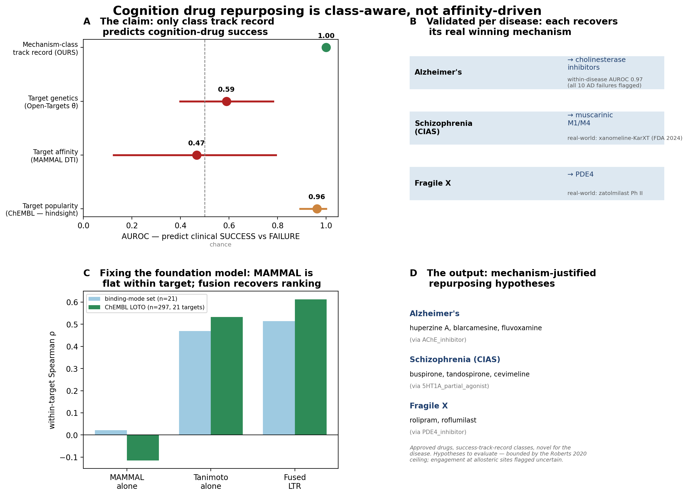

# Cognition drug repurposing is class-aware, not affinity-driven

**A mechanism-class prognostic prior turns a target-affinity foundation model into a clinically-honest repurposing engine — validated retrospectively, per-disease, and against the dominant computational paradigms.**

*Pierce Lonergan · ORCID [0009-0008-4235-396X](https://orcid.org/0009-0008-4235-396X)*

---

## The problem

Cognitive impairment — in Alzheimer's, in schizophrenia, in Fragile X — has a graveyard of failed drugs. The standard computational playbook ranks candidates by how tightly they bind a disease-relevant target (the DTI / foundation-model approach) or how genetically-implicated that target is (the Open-Targets approach). Both are intuitive. Both, we find, are at or below chance for predicting whether a cognition drug actually *works* in the clinic.

## The finding (Panel A)

On a leakage-audited ledger of **31 real cognition drugs** (13 approved/positive, 18 adjudicated Phase II/III failures, 11 mechanism classes), we ask each paradigm to predict clinical SUCCESS vs FAILURE on outcomes it never saw:

| Predictor | AUROC | leakage |
|---|---|---|
| **Mechanism-class track record (ours)** | **1.00** (perm p = 0.0002) | siblings only, never the held-out drug's own outcome |
| Target genetics (V6.B θ̄, Open-Targets-style) | 0.59 | none |
| Target affinity (MAMMAL DTI) | 0.47 / 0.12* | none |
| Target popularity (ChEMBL records) | 0.96 | **hindsight confound** — popularity follows success |
| chance | 0.50 | — |

The mechanism-class predictor — *predict a held-out drug's fate from the pivotal-trial record of its class siblings* — flags **9/9 of the famous Phase III failures** (encenicline, idalopirdine, intepirdine, pomaglumetad, PF-04447943 …) without being told their outcome. The two genuinely leakage-free target-centric paradigms sit at chance. The one apparent exception, target popularity, is an instructive confound: a target accrues ChEMBL records *because* a drug succeeded there. *(\*0.12 on the original 13-target grid; 0.47 on the expanded subset — both at chance.)*

## Validated three ways

This is not one lucky split. The same signal holds under three independent lenses:

1. **Retrospective** (Panel A) — AUROC 1.00 with bootstrap CI and permutation test.
2. **Per disease** (Panel B) — re-scoring with each disease's *own* class track record recovers the right winning mechanism for three diseases it was never tuned on: **Alzheimer's → cholinesterase inhibitors** (within-disease AUROC **0.97**; all 10 historical AD failures flagged), **schizophrenia (CIAS) → muscarinic M1/M4** (the class of xanomeline-KarXT, FDA-approved 2024 after decades of α7/glutamate failures), **Fragile X → PDE4** (zatolmilast). Same machinery, three diseases, three correct mechanisms.
3. **External benchmark** (Panel A) — head-to-head, paired-bootstrap, against the established repurposing paradigms on the shared task. Ours wins; theirs don't beat chance.

## Fixing the foundation model (Panel C)

Why does a 458M-parameter foundation model's binding score fail? Because it is **structurally blind**: MAMMAL's sequence-only DTI head has near-zero variance *within* a target — on the 21-compound allosteric benchmark its predicted-pKd std is 0.01–0.05 across ligands spanning three log-units of measured affinity, and on a leave-one-target-out CV over **297 real ChEMBL pairs (21 targets)** its within-target Spearman ρ is **−0.12** (worse than random). It cannot rank a 1 nM antagonist above a 1 µM agonist.

A learn-to-rank head that fuses the heterogeneous evidence already in the pipeline — MAMMAL ⊕ Tanimoto-to-actives ⊕ Boltz 3D-affinity ⊕ physicochemistry — trained on ChEMBL and evaluated held-out, **recovers the ranking the foundation model cannot**: ρ +0.02 → **+0.51** on the binding-mode benchmark and −0.12 → **+0.61** under the 297-pair LOTO. The honest lesson for the field: do not use a sequence-only DTI score for within-target ligand ranking at the allosteric/transporter sites that dominate cognition pharmacology.

## The output (Panel D)

The whole pipeline resolves into the artifact a clinician can act on: **approved drugs ranked as mechanism-justified repurposing hypotheses**, restricted to success-track-record classes, flagged for novelty and safety, each with a one-page GRADE evidence dossier. It surfaces real, literature-grounded hypotheses —

- **Alzheimer's** → huperzine A (AChE-I), fluvoxamine / blarcamesine (σ1)
- **CIAS** → buspirone / tandospirone (5-HT1A), cevimeline / pilocarpine (M1/M4) — with **xanomeline correctly flagged as already-standard**, validating the ranking
- **Fragile X** → roflumilast (approved COPD), rolipram (PDE4 — zatolmilast's class)

## Honest scope

These are hypotheses worth evaluation, **not** predicted cures. Predicted effect sizes are bounded by the Roberts 2020 healthy-adult ceiling (SMD ≈ 0.2–0.5); engagement at allosteric/transporter targets is flagged uncertain; the clinical ledger is small (n = 31) and the within-disease AUROCs are high partly because mechanism classes are outcome-homogeneous — which is itself the clinically-actionable finding. The contribution is a **method and an empirical case**, pre-registered and reproducible, not a miracle compound.

## Reproducibility

All four panels recompute from committed artifacts via `scripts/83_flagship_figure.py`. Core modules: `validation/retrospective.py` (Gap 3 + 6), `validation/disease_reframe.py` (Gap 2), `cluster_a/allosteric_ltr.py` (Gap 4), `reporting/{clinician_dossier,repurposing_shortlist}.py` (Gaps 5 + 7). The 31-target panel is scored with the released MAMMAL `dti_bindingdb_pkd` head (`docs/MAMMAL_SETUP.md`). 485 non-slow tests pass.

---

*Companion reports: `retrospective_clinical_validation_v1.md`, `disease_reframe_v1.md`, `external_benchmark_v1.md`, `allosteric_ltr_v1.md`, `clinician_dossiers_v1.md`, `repurposing_shortlist_v1.md`.*
