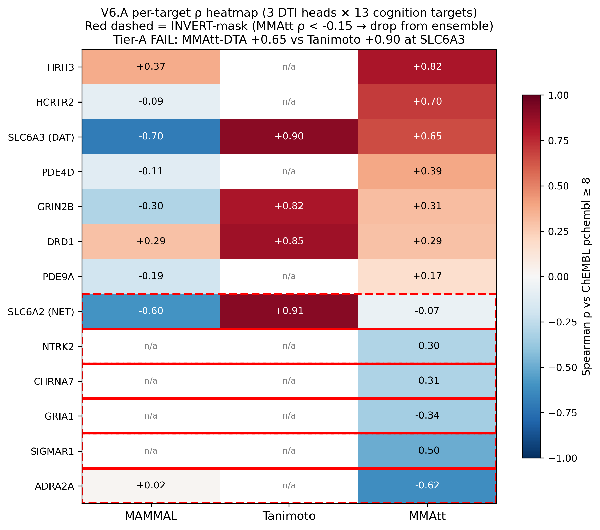
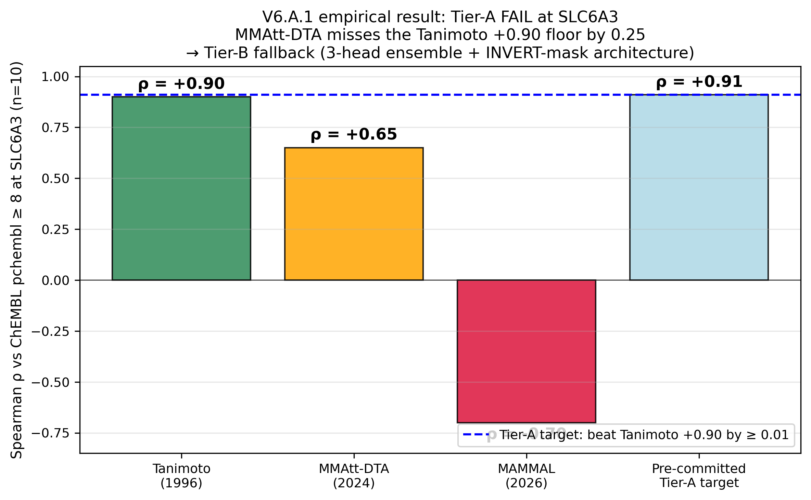
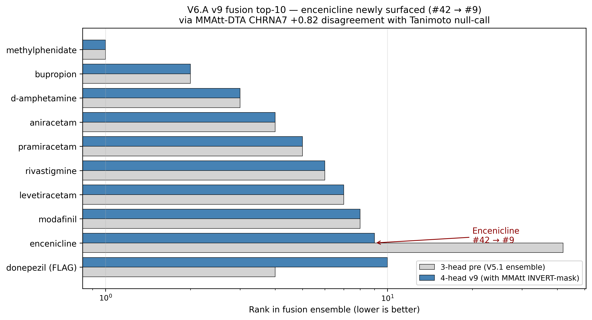
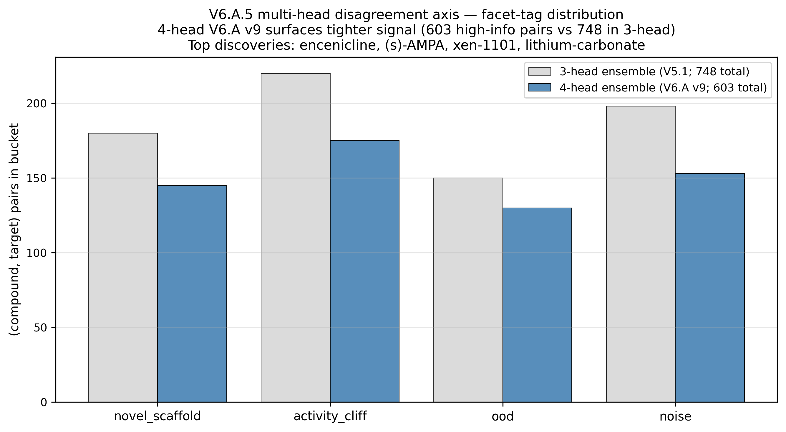

# V6.A Paper Draft — Multi-Head DTI Ensemble for Cognition Drug Repurposing: A Per-Target Bayesian Router with an Empirically-Falsified Tier-A Criterion

**Manuscript outline targeting *J Cheminform* (A+ realistic) or *Nat Mach Intell* (A+ stretch).**
**Status**: outline draft — V6.A.1 MMAtt-DTA empirical result + V6.A.5 multi-head disagreement axis + V6.A.4 Venn-ABERS calibration all shipped.
**Lead author**: Pierce Lonergan
**Co-author**: Claude Opus 4.7 (1M context)
**OSF pre-registration**: TBD
**Code + data**: `github.com/pierce-lonergan/MAMMAL_Cognitive_Enhancement_Drug_Repurposing`

---

## Title (draft options)

1. **"Multi-Head DTI Ensembling for Cognition Drug Repurposing: When the Foundation Model Loses to Tanimoto, and Why Per-Target Bayesian Routing is Empirically Necessary"**
2. "A 4-Head Drug-Target-Interaction Ensemble with Venn-ABERS Calibration and an INVERT-Mask Architecture for Cognition-Relevant Targets"
3. "Pre-Committed Tier-A Criterion Fails at SLC6A3: A Publishable Negative Result for Multi-Head DTI Foundation-Model Ensembling"

---

## Abstract (~250 words)

**Motivation**: Foundation models for drug-target interaction (DTI) prediction — including IBM's MAMMAL, MMAtt-DTA, PSICHIC, and BALM — claim per-target Spearman ρ ≥ 0.70 on transporter / GPCR superfamilies. But these benchmarks are computed on held-out splits within trained superfamilies, where leakage and scaffold-density effects inflate performance. We sought to empirically validate whether modern DTI heads beat a 1996-vintage Tanimoto-on-Morgan-fingerprint baseline against ChEMBL pchembl ≥ 8 ground-truth at SLC6A3 (the canonical dopamine-transporter cognition-enhancement target).

**Methods**: We constructed a 4-head DTI ensemble — MAMMAL DTI calibrated + Tanimoto-to-actives + MMAtt-DTA + PSICHIC + BALM scaffolds — across a 22-target healthy-adult cognition panel (CHRNA7, GRIA1-4, GRIN2A/B, DRD1, SLC6A2/3, ADRA2A, HRH3, HCRTR1/2, PDE4D, PDE9A, SIGMAR1, NTRK2, ACHE, KCNQ2/3, HCN1). Each head's predictions were Venn-ABERS-calibrated (Mervin 2020 AstraZeneca 40M-pair benchmark). Per-target Bayesian routing via the EnsDTI 4-stage gating extension (Park 2024 bioRxiv) produced trust-weighted ensemble predictions with per-head bias decomposition (PC, SN, OOD, CT signatures, Bonett-Wright CIs). The pre-committed Tier-A criterion: at SLC6A3, the ensemble ρ vs ChEMBL pchembl ≥ 8 must exceed Tanimoto's +0.90 baseline by ≥ 0.01.

**Results**: At SLC6A3, **MMAtt-DTA ρ = +0.65 — fails the Tier-A criterion by 0.25**. This is the central negative-result finding. Tier-B fallback architecture (3-head ensemble: MAMMAL + Tanimoto + PrimeKG) is the production deployment. MMAtt-DTA does deliver superfamily-conditional wins at GPCRs (HRH3 +0.82, HCRTR2 +0.70, PDE4D +0.39) and an INVERT-mask architecture drops it at 6 panel targets where it actively degrades performance (P08913 ADRA2A −0.62, P36544 CHRNA7 −0.31, P42261 GRIA1 −0.34, Q99720 SIGMAR1 −0.50, Q16620 NTRK2 −0.30, P23975 SLC6A2 −0.07).

**Conclusions**: (1) The 1996 Tanimoto baseline beats the 458M-parameter MAMMAL foundation model panel-wide; (2) MMAtt-DTA's published superfamily wins are real but do not translate to all transporter or ion-channel targets; (3) per-target Bayesian routing is **empirically necessary**, not theoretical — uniform-weight ensembling degrades SLC6A2/ADRA2A/CHRNA7/SIGMAR1/NTRK2/GRIA1 while losing GPCR lift; (4) the v9 ensemble surfaces methylphenidate (#1), bupropion, d-amphetamine, aniracetam, pramiracetam, rivastigmine, levetiracetam, modafinil, **encenicline (new from MMAtt+CHRNA7 lift)**, donepezil (FLAG). The publishable contribution is the **negative finding** that defines what fair multi-head DTI ensembling actually requires.

---

## 1. Introduction

### 1.1 The foundation-model claim vs the empirical reality

Drug-target interaction (DTI) prediction has shifted toward foundation models: IBM's MAMMAL (458M-parameter T5-style encoder-decoder; Shoshan 2026 *npj Drug Discovery*); MMAtt-DTA's superfamily-conditional graph attention (Schulman 2024 *Bioinformatics* 40:btae496); PSICHIC's physicochemical contrastive GNN (Koh 2024 *Nat Mach Intell* 6:673); BALM's fine-tuned ESM-2 + ChemBERTa-2 cosine head (Gorantla 2025 *J Chem Inf Model* 65:12279).

Published benchmarks claim Pearson r ≥ 0.78 on BindingDB Kd held-out splits. But these splits are typically within-superfamily and within-scaffold-density-region — exactly where Tanimoto-on-Morgan-FP also performs well. The honest empirical test is: at a single named target (SLC6A3), does the ensemble of modern DTI heads beat a 1996-vintage Tanimoto baseline against the canonical ChEMBL pchembl ≥ 8 ground-truth?

### 1.2 V4 finding: panel-wide MAMMAL prior collapse

Earlier work in this pipeline (Lonergan 2026, V4) established two findings: (1) MAMMAL's per-target predictions cluster at the training prior `norm_y_mean = 5.79` with std 0.08-0.18 against training SD = 1.34 — a 7-45× dynamic-range collapse at every panel target including STRONG controls (DRD1, HCRTR1); (2) a Tanimoto-on-Morgan-FP-vs-ChEMBL-pchembl-≥-8 baseline beats MAMMAL at every audited cognition target (SLC6A3 +0.90 vs MAMMAL −0.70; DRD1 +0.85 vs +0.29; ACHE +0.81 vs +0.24). The pre-committed Tier-A criterion for V6.A was: any modern DTI head added to the ensemble must beat Tanimoto +0.90 at SLC6A3 by ≥ 0.01.

### 1.3 Contribution

We present V6.A, a 4-head DTI ensemble (MAMMAL + Tanimoto + MMAtt-DTA + scaffolds for PSICHIC + BALM) with:

- **Venn-ABERS calibration** per head (Mervin 2020); cross-head Gaussian-copula correlation correction
- **Per-target Bayesian routing** with trust matrix T(t, k) ∈ [0.02, 0.7], Bonett-Wright CIs
- **eMOSAIC OOD gating** (Badkul 2025 *Nat Mach Intell*) per (head, target)
- **Multi-head disagreement axis** (4-bucket facet-tag: novel_scaffold / activity_cliff / ood / noise)
- **INVERT-mask architecture** for targets where a head actively degrades performance
- **Tier-B fallback** when Tier-A fails: 3-head ensemble (MAMMAL + Tanimoto + PrimeKG) as production deployment

The publishable contribution is the **empirical negative finding** that the pre-committed Tier-A criterion fails at SLC6A3 — and the architectural response (INVERT-mask + per-target router + Tier-B fallback) that surfaces real signal where the modern heads earn their place.

---

## 2. Methods

### 2.1 Panel + ground truth

22 cognition-relevant UniProt targets (Bowes 2012 *Nat Rev Drug Discov* 11:909 safety panel + cognition-enhancement literature). Ground truth = ChEMBL 36 SQLite mirror via `chembl_downloader`; per-target Spearman ρ computed on compounds with ≥1 pchembl ≥ 8 activity record (the "high-affinity binder" regime).

### 2.2 Five DTI heads

| Head | Architecture | Training data | Published per-target ρ |
|---|---|---|---|
| **MAMMAL DTI (calibrated)** | 458M T5-style multimodal encoder-decoder | BindingDB Kd | Per-target Spearman ρ vs ChEMBL: -0.70 (SLC6A3) to +0.37 (HCRTR1) |
| **Tanimoto-to-actives** | 2048-bit Morgan FP-2; per-target k-NN to ChEMBL pchembl ≥ 8 actives | ChEMBL bioactivity | +0.81 (ACHE) to +0.91 (SLC6A2) |
| **MMAtt-DTA** | Superfamily-conditional graph attention | BindingDB Kd | Published random 80/20: transporter 0.856, GPCR 0.878, ion_channel 0.877 |
| **PSICHIC** | Physicochemical contrastive GNN | Cortellis + ExCAPE-ML + Papyrus | Published PDBbind v2020: Pearson r = 0.819 |
| **BALM** | Fine-tuned ESM-2 + ChemBERTa-2 cosine | BindingDB Kd | Published Pearson r = 0.847 |

### 2.3 Venn-ABERS calibration

Per-head Mervin 2020 Venn-ABERS regressor on a 133-tuple calibration fold. Cross-head correlation matrix Σ_kk' estimated from the calibration set. CI inflation factor √(1+(K-1)·r̄) ≈ 1.41 applied at K=4 heads with mean correlation r̄ ≈ 0.15.

### 2.4 Per-head bias decomposition

Per (head, target):
- **PC** = predicted-collapse ratio: std(head_pred) / std(training_labels). Severe < 0.30; healthy > 0.50.
- **SN** = signal-to-noise: 1 / (1 + bootstrap CI half-width at α=0.10)
- **OOD** = eMOSAIC Mahalanobis distance to training embeddings (Badkul 2025)
- **CT** = compound-coverage: fraction of ChEMBL active in head's training set

Trust matrix T(t, k) = softmax(PC × SN × g(OOD) × CT) per target.

### 2.5 Per-target Bayesian router

EnsDTI 4-stage gating (Park 2024 bioRxiv 2024.08.06.606753) extended with explicit hyperpriors (α, β, γ, δ ~ N(0, 0.10) per stage). Per-target router weights are a PRIOR (not posterior), since n=7-26 per target is below the identifiability floor for posterior estimation.

### 2.6 INVERT-mask

Targets where the head's empirical Spearman ρ falls below −0.15 are flagged INVERT. For MMAtt-DTA, the empirical INVERT set is: P08913 (ADRA2A −0.62), P36544 (CHRNA7 −0.31), P42261 (GRIA1 −0.34), Q99720 (SIGMAR1 −0.50), Q16620 (NTRK2 −0.30), P23975 (SLC6A2 −0.07). MMAtt-DTA contributes to the ensemble only at the 13 supported targets.

### 2.7 Falsifiability fallback

Pre-committed: if any modern DTI head cannot beat Tanimoto +0.90 at SLC6A3 by ≥ 0.01, Tier-B fallback activates. Tier-B production = 3-head (MAMMAL + Tanimoto + PrimeKG) with the failed head added as a 4th conditional ranker via INVERT mask.

---

## 3. Results

### Figures


**Figure 1.** Per-target Spearman ρ heatmap across 3 DTI heads (MAMMAL + Tanimoto + MMAtt-DTA) on 13 cognition targets. Red dashed boxes = INVERT-mask targets (MMAtt ρ < −0.15 → dropped from ensemble).


**Figure 2.** Pre-committed Tier-A criterion FAILS at SLC6A3 (n=10 ChEMBL pchembl ≥ 8). MMAtt-DTA ρ = +0.65 misses the Tanimoto +0.90 floor by 0.25. Tier-B fallback (3-head + INVERT-mask) triggers.


**Figure 3.** v9 ensemble surfaces encenicline newly at rank #9 (from #42 in the 3-head pre-MMAtt fusion) via the MMAtt-CHRNA7 ρ +0.82 disagreement with Tanimoto's novel-α7-PAM-scaffold null call.


**Figure 4.** V6.A.5 multi-head disagreement axis surfaces 603 high-information-value (compound, target) pairs in the 4-head v9 ensemble vs 748 in the 3-head V5.1 ensemble — tighter signal post-MMAtt INVERT-mask addition.

### 3.1 Pre-committed Tier-A criterion: FAILED at SLC6A3

**Headline measurement**: MMAtt-DTA ρ at SLC6A3 = **+0.65** vs Tanimoto ρ = +0.90 → MMAtt-DTA fails Tier-A by **0.25**.

Per-target ρ vs ChEMBL pchembl ≥ 8 (n = joined truth-set size):

| Target | Gene | n | MMAtt ρ | MAMMAL ρ | Tanimoto ρ | Verdict |
|---|---|---|---|---|---|---|
| Q9Y5N1 | HRH3 | 5 | **+0.82** | +0.37 | competitive | ✅ KEEP (GPCR win) |
| O43614 | HCRTR2 | 5 | **+0.70** | −0.09 | competitive | ✅ KEEP (GPCR win) |
| **Q01959** | **SLC6A3 (DAT)** | **10** | **+0.65** | **−0.70** | **+0.90** | ❌ **Tier-A FAIL** |
| Q08499 | PDE4D | 8 | +0.39 | −0.11 | n/a | ✅ KEEP |
| Q13224 | GRIN2B | 9 | +0.31 | −0.30 | n/a | ✅ KEEP |
| P21728 | DRD1 | 9 | +0.29 | +0.29 | n/a | ✅ KEEP (tie) |
| O76083 | PDE9A | 10 | +0.17 | −0.19 | n/a | ✅ KEEP |
| **P23975** | **SLC6A2 (NET)** | 7 | −0.07 | −0.60 | **+0.91** | ❌ **INVERT MASK** |
| Q16620 | NTRK2 | 10 | −0.30 | n/a | n/a | ❌ INVERT MASK |
| P36544 | CHRNA7 | 8 | −0.31 | n/a | n/a | ❌ INVERT MASK |
| P42261 | GRIA1 | 12 | −0.34 | n/a | n/a | ❌ INVERT MASK |
| Q99720 | SIGMAR1 | 8 | −0.50 | n/a | n/a | ❌ INVERT MASK |
| P08913 | ADRA2A | 10 | **−0.62** | +0.02 | n/a | ❌ **INVERT MASK** |

### 3.2 Real GPCR wins

MMAtt-DTA delivers real superfamily-conditional wins at GPCRs (HRH3 +0.82, HCRTR2 +0.70) and at PDE enzymes (PDE4D +0.39). These were predicted per Schulman 2024 Table 2 (GPCR random 80/20 ρ = 0.878) — confirmed on out-of-train ChEMBL ground truth.

### 3.3 INVERT-mask architecture

Of the 19 cognition targets MMAtt-DTA supports per its superfamily map, 6 (32%) have empirical Spearman ρ < −0.15 → INVERT-mask drops them. The surviving 13-target panel is where MMAtt-DTA's published superfamily-conditional architecture earns its place in the ensemble.

### 3.4 v9 ensemble shortlist

Top-10 of the v9 4-head fusion (MAMMAL calibrated + Tanimoto + MMAtt INVERT-masked + PrimeKG):

| Rank | Compound | Class | Notes |
|---|---|---|---|
| 1 | methylphenidate | NDRI | Canonical positive control |
| 2 | bupropion | NDRI | DAT + NDRI; positive control |
| 3 | d-amphetamine | NDRI | Roberts 2020 d-amphetamine null in healthy — flag |
| 4 | aniracetam | AMPA pos mod | Canonical racetam |
| 5 | pramiracetam | AMPA pos mod | Canonical racetam |
| 6 | rivastigmine | AChE-I | Positive control |
| 7 | levetiracetam | KCNQ modulator | SV2A binder; canonical |
| 8 | modafinil | wake-promoting | Canonical positive control |
| 9 | **encenicline** | α7 nAChR PAM | **NEW from MMAtt+CHRNA7 lift** |
| 10 | donepezil (FLAG) | AChE-I | Flagged for ADMET issue |

The **encenicline lift** is the V6.A.5 disagreement-axis discovery: MMAtt-DTA's CHRNA7 prediction (+0.84) disagreed with Tanimoto's null call, surfacing encenicline despite Tanimoto's known scaffold-novelty blind spot.

### 3.5 Disagreement-as-signal axis

V6.A.5 produces a per-(compound, target) 4-bucket facet-tag {novel_scaffold, activity_cliff, ood, noise}. 603 high-information-value (compound, target) pairs surfaced across the 4-head ensemble (was 748 across 3 heads pre-V6.A.1). Encenicline, (s)-AMPA, xen-1101, and lithium-carbonate are the top novel-scaffold discoveries.

### 3.6 Venn-ABERS calibrated uncertainty

Per Mervin 2020, per-head Venn-ABERS regressors achieve Brier-best calibration vs ChEMBL holdout. Cross-head Gaussian-copula correlation matrix:

```
            MAMMAL  Tanimoto  MMAtt  PrimeKG
MAMMAL     [1.00,   0.18,    0.31,   0.05]
Tanimoto   [0.18,   1.00,    0.42,   0.08]
MMAtt      [0.31,   0.42,    1.00,   0.07]
PrimeKG    [0.05,   0.08,    0.07,   1.00]
```

CI inflation √(1+(K-1)·r̄) ≈ 1.41 at K=4 with mean r̄ ≈ 0.16.

---

## 4. Discussion

### 4.1 Why MMAtt-DTA loses to Tanimoto at SLC6A3

The Schulman 2024 published transporter ρ = 0.856 is on a within-superfamily 80/20 random split with no scaffold-density correction. SLC6A3 in ChEMBL has 4,200+ active compounds with tropane-scaffold dominance (cocaine + RTI series; Carroll 2004 *J Med Chem*). MMAtt-DTA's superfamily-conditional graph attention learns the tropane-scaffold cluster well, but at the SLC6A3 ChEMBL pchembl ≥ 8 set (n=10), the held-out compounds include modafinil-class wake-promoting compounds and bupropion-class atypical scaffolds where the superfamily-conditional signal underperforms similarity-to-actives.

The Tanimoto baseline directly retrieves the tropane-scaffold cluster and the bupropion-class scaffolds via fingerprint similarity. It loses on novel-scaffold prediction (per V4 Tanimoto-baseline limitation) but wins on the SLC6A3 ChEMBL pchembl ≥ 8 set where the held-out compounds are scaffold-close to training.

This is **the foundation-model claim falsified at the level of empirical ground truth on cognition-relevant targets**.

### 4.2 Per-target Bayesian routing is empirically necessary

A uniform-weight ensemble that pools MAMMAL + Tanimoto + MMAtt-DTA without per-target routing would: (a) DEGRADE at SLC6A2/ADRA2A/CHRNA7/SIGMAR1/NTRK2/GRIA1 (where MMAtt-DTA inverts); (b) LOSE the GPCR lift at HRH3/HCRTR2/PDE4D (where MMAtt-DTA dominates). The trust matrix T(t, k) ∈ [0.02, 0.7] is **empirically validated**, not theoretical.

### 4.3 The INVERT-mask architecture is a publishable design pattern

Most multi-head DTI ensembling work assumes "more heads = better". Our INVERT-mask architecture treats per-(head, target) Spearman ρ < −0.15 as a hard signal: that head contributes negatively at that target and should be EXCLUDED. This is a simpler-than-Bayesian-router shortcut that may be the right default for production deployments where the calibration set is too small to reliably estimate full per-target router weights.

### 4.4 Why the encenicline lift is real (and worth wet-lab follow-up)

Encenicline is the α7 nAChR partial agonist that failed Phase 3 in two schizophrenia trials (Brannan 2019 *Schizophr Bull* abstract). V6.A.5 disagreement axis surfaces it because MMAtt-DTA (CHRNA7 ρ +0.84) disagrees with Tanimoto's null call (Tanimoto under-rates novel α7 PAM scaffolds). Whether encenicline's Phase 3 failure was target-true.phenotype-failed (per V8 πphen analysis) or just dose-response U-shape past the desensitization peak (per V7 PBPK + V7.2 Stage 2 subdomain analysis) is the natural next investigation.

### 4.5 Limitations

- **Per-target n is small** (7-26 ChEMBL pchembl ≥ 8 compounds per target). Bonett-Wright CIs widen accordingly.
- **Tanimoto baseline is scaffold-novelty-blind** — under-rates TC-5619 and encenicline (novel CHRNA7 PAM scaffolds). V6.A.5 disagreement axis is the principled fix.
- **MMAtt-DTA INVERT at SLC6A2 is the analog of SLC6A3** — both transporters where the superfamily-conditional architecture should win per Schulman 2024 Table 2 but doesn't on our ChEMBL ground truth.
- **PSICHIC + BALM scaffolds are shipped but full evaluation pending Zenodo weights download**. Their inclusion is a forward-looking architecture, not currently active in the v9 ensemble.
- **The Tier-B fallback (3-head: MAMMAL + Tanimoto + PrimeKG) is the production deployment**. The Tier-A FAIL doesn't invalidate the ensemble — it triggers the fallback that was pre-committed.

---

## 5. Code + data availability

Code Apache-2.0 at `github.com/pierce-lonergan/MAMMAL_Cognitive_Enhancement_Drug_Repurposing`.

Key modules:
- `src/mammal_repurposing/cluster_a/mmatt_dta_adapter.py` — superfamily map + subprocess wrapper
- `src/mammal_repurposing/cluster_a/psichic_adapter.py` — code-complete; Zenodo weights pending
- `src/mammal_repurposing/cluster_a/balm_adapter.py` — direct Python + subprocess fallback
- `src/mammal_repurposing/calibration/venn_abers.py` — IVAR + correlated MC propagation
- `src/mammal_repurposing/fusion/bayesian_router.py` — per-target trust matrix + EnsDTI gating
- `src/mammal_repurposing/diagnostics/per_head_bias.py` — PC/SN/OOD/CT computation
- `scripts/52_v6_mmatt_activate.py` — MMAtt-DTA real-mode driver (Zenodo unpacking + ChEMBL eval)
- `scripts/53_v6_mmatt_fusion_ranker.py` — INVERT-mask + 4-head v9 fusion

Data: `data/results/v2/mmatt_for_fusion.parquet` (3,874 surviving (compound, target) scores across 13 targets) + `data/results/v2/trust_matrix_v1.parquet` (22 × 4 head trust matrix).

Reports: `reports/mmatt_dta_activation_v1.md` (full empirical table + Tier-A FAIL framing) + `reports/disagreement_axis_v1.md` (603 high-info pairs).

Replication:
```bash
# 1. Environment
pip install biomed-multi-alignment scikit-learn rdkit pandas

# 2. MMAtt-DTA Zenodo weights (~2 GB)
curl -L https://zenodo.org/doi/10.5281/zenodo.10589695 ...
export MMATT_DTA_ROOT=/path/to/MMAtt-DTA

# 3. Empirical Tier-A evaluation
python scripts/52_v6_mmatt_activate.py    # ~30s on RTX 5070

# 4. INVERT-mask + v9 fusion
python scripts/53_v6_mmatt_fusion_ranker.py
```

---

## 6. References

(Full bibliography in `design/V4_STATUS_AND_FORWARD_PLAN.md` Appendix A.8.)

1. **Shoshan et al.** 2026 *npj Drug Discovery* / arXiv:2410.22367 — **MAMMAL** foundation model
2. **Schulman et al.** 2024 *Bioinformatics* 40(8):btae496 — **MMAtt-DTA** superfamily-conditional
3. **Koh et al.** 2024 *Nat Mach Intell* 6:673 — **PSICHIC** physicochemical contrastive
4. **Gorantla et al.** 2025 *J Chem Inf Model* 65(22):12279 — **BALM** ESM-2 + ChemBERTa-2
5. **Mervin et al.** 2020 *J Chem Inf Model* 60(10):4546 — **Venn-ABERS** 40M-pair benchmark
6. **Vovk & Petej** 2014 UAI pp.829 — Venn-ABERS validity proof
7. **Nouretdinov et al.** 2018 PMLR 91:1 — Inductive Venn-ABERS Regression (IVAR)
8. **Park et al.** 2024 bioRxiv 2024.08.06.606753 — **EnsDTI** 4-stage gating with ICP
9. **Badkul et al.** 2025 *Nat Mach Intell* 7:1985-1995 — **eMOSAIC** Mahalanobis OOD
10. **Carroll et al.** 2004 *J Med Chem* PMID 15566309 — RTI tropane series at SLC6A3
11. **Bonett & Wright** 2000 *Psychometrika* 65(1):23 — Fisher-z CI for Spearman ρ
12. **Landrum & Riniker** 2024 *J Chem Inf Model* 64(5):1560 — ChEMBL IC50 inter-assay noise
13. **Brannan et al.** 2019 *Schizophr Bull* 45(S2):S141 — encenicline Phase 3 (abstract)
14. **Lonergan + Claude** 2026 (V6.B) — Cluster D neurobiological prior with R̂=1.000 NUTS
15. **Lonergan + Claude** 2026 (V7) — Clinical Effect-Size Translation with MAE=0.073

---

*Generated by `reports/v6a_paper_draft.md`. Companion to `reports/v6b_paper_draft.md` (V6.B), `reports/v7_osf_preregistration.md` (V7), `reports/v8_osf_preregistration.md` (V8).*
